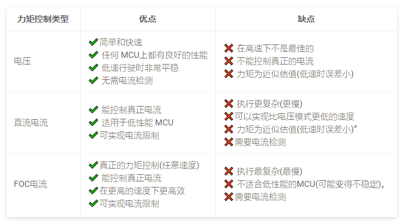

# Haptic knob
痛点：我们的机器控制中，对于坐标的反馈并不直观，单纯通过数字和触摸屏很难做到对现实位置的高精度拟合。 

解决方法： 研发触觉旋钮，对于位置有一个更精准的测量。

如果不出意外地话，力矩控制将是作为旋钮的最佳的控制策略。在我的预想中，结合我现在所学到的知识，我觉得旋钮主要用于实现以下功能：
1. 精确地触觉反馈，以一个较高的控制精度来输入控制角度。或者可以进行对目标的坐标变换，当用户每微调一个刻度，对应的目标值就会相应的移动相应的位置。例如，用户可以选择控制的精度，例如1cm, 或者1mm, 然后我们就可以对应不同的精度在旋钮中模拟出不同的触感。让用户知道，他移动的这一下就是1cm或者1mm。 类似于Surface dial, 但是不同的是，我们对于不同的刻度有不同的触觉反馈。
2. 电子围栏，除了触觉反馈，我们还可以加入电子围栏。 我们可以通过控制和算法来限制用户的输入范围，当用户输入超过一定的范围， 电机就会给出一个较大的力反馈来提醒用户的输入超过量程。
3. 力反馈，通过FOC控制的旋钮是可以有一个精确地力反馈的。在一些场景下，我们需要对力矩有一个精确地控制，我就们可以通过旋钮来直观感受力的大小。这样就可以实现所谓的像素级控制。（*这个部分可能对电机和驱动板有一定的要求，力反馈可能需要较大的电流。）


simpleFOClibrary对于FOC控制提供了一个很好地解决方案。
`simpleFOClibrary`有三种不同的力矩控制策略。
 - Voltage mode
 - DC current mode 
 - FOC current model


## 1. 转矩控制 Torque control
简单来说，**电压控制模式**是最简单的的电机力矩控制的近似策略， 他可以使用电机+驱动器+MCU集成的方式来解决。 **直流电流模式**是电机扭矩近似的下一步，比电压模式更精确，但需要电流感应和更强大的微控制器。**FOC电流模式**是控制电机的真实扭矩，它不是一个近似值，它也需要电流传感器和比直流电流模式更强的处理能力。请参阅扭矩模式文档中的深入解释。

如果使用了电压控制模式，并且用户不并没有提供电机相电阻的参数，力矩控制环的输入将会是目标电压$U_q$:


如果任意之一的基于电流的控制模式被使用，控制环的输入将会是目标电流$i_q$. 如果用户向电机类提供相位电阻值，在电压模式下也是如此.


力矩控制环是其它素有控制环的基础。

#### 配置参数
基于不同的控制类型需要考虑不停地控制参数
- 电压模式，最简单的模式，只需要`motor.phase_resistance`
- 直流电流模式， 1xPID控制器， + 1X LPF
- FOC电流控制模式， 2XPID controller, + 2xLPF filters
  
#### 对比
  


### 1.1 基于电压的力矩控制

#### 电压控制的理论基础
电压控制算法从位置传感器读取角度a（所以说明必须要选择一个较高精度的编码器）, 从用户获取目标$U_q$电压值, 通过FOC算法设置电机合适的$U_a$, $U_b$ 和 $U_c$。FOC算法确保这些电压在电机转子中。FOC算法确保这些电压产生的磁力恰好与电机转子的永磁场偏移90度 ，从而保证了最大力矩，这称为换向。

对于精确实现直流电机原理来说这是一种困难的方法。因为对于直流电动机来说，转子所产生的磁场与定子所产生的永磁场之间的90度角是基于硬件实现的。现在，当你有FOC算法保证的90度约束，你可以使用这个电压控制方法去控制任何其他直流电机。

因此，对于直流电动机，我们知道电机扭矩 T与电流I成正比：
$$
T = I*K 
$$
其中 K 是由其硬件定义的电机常数。 我们还知道，电流与设定的电压U成正比:
$$
I  = (U - EMF)/R
$$
其中 R是电机内阻，EMF是产生的反EMF电压。这个方程没有考虑任何动力学因素，但总的来说还是很有效的。

所以我们可以从所有这些中得出的结论是（如果我们忽略EMF）：
$$
T \sim I \sim U
$$
这意味着扭矩与电流成比例。而由于电流与电压成比例，那么扭矩也与电压成比例。

> 注意，责怪成比例的假设只适用于静力学而不是动力学，这意味着由于不同的动力学效应将会有一些电流峰值。但如果电流不是很大，这些影响可以忽略。电流 <5A。 对于真正的力矩控制环，我们需要测量电流，但用于电流测量的硬件在低功耗的应用中并不常见，因此这种力矩控制实现是唯一绕过它的方法。


基于电压的力矩控制能够像直流电机那样控制直流无刷电机，即设置目标电压$U_q$，然后FOC算法计算出所需的相电压ua，ub和uc达到顺滑控制效果。该模式设置如下：

```c
// 基于电压的力矩控制模式
motor.torque_controller = TorqueControlType::voltage;
```
#### 它到底是如何工作的


基于电压控制的算法从位置传感器读取角度a ，从用户中获得目标电压值 $U_q$，然后用FOC算法设置适当的 $U_a$, $U_b$ 和 $U_c$ 电压到电机。FOC算法确保这些电压产生的磁力恰好与电机转子的永磁场偏移 90度 ，从而保证了最大力矩，这称为换向。`

假设电机产生的力矩与设定电压 $U_q$ 成正比，也就是说最大力矩与$U_q$ 有关，而这个$U_q$ 则受到供电电压的限制。最小力矩当然即$U_q$ = 0。

如果用户设置了电机的相电阻值，那么用户就可以设置期望电流 $I_d$ ，而后库会自动计算出相应的目标电压 $U_q$。例如，下面这个可以通过构造函数来完成：
```c
// BLDCMotor(pole pair number极对数, phase resistance相电阻)
BLDCMotor motor = BLDCMotor(11, 2.5);
```
或者单纯通过设置参数:
```c
motor.phase_resistance = 2.5; // 如：2.5 Ohms
```


### 1.2 Haptic knob 控制逻辑
1. 电机工作在力矩控制状态，此时不对力矩做任何限制。
2. 完成角度读取部分，此时能保证获得当前电机的角度。
3. 将电机分为几个刻度，令电机能较为准确的吸附在这些角度上。
4. 然后对相应的力矩进行微调，做到准确的吸附在相应的刻度上。
   
   